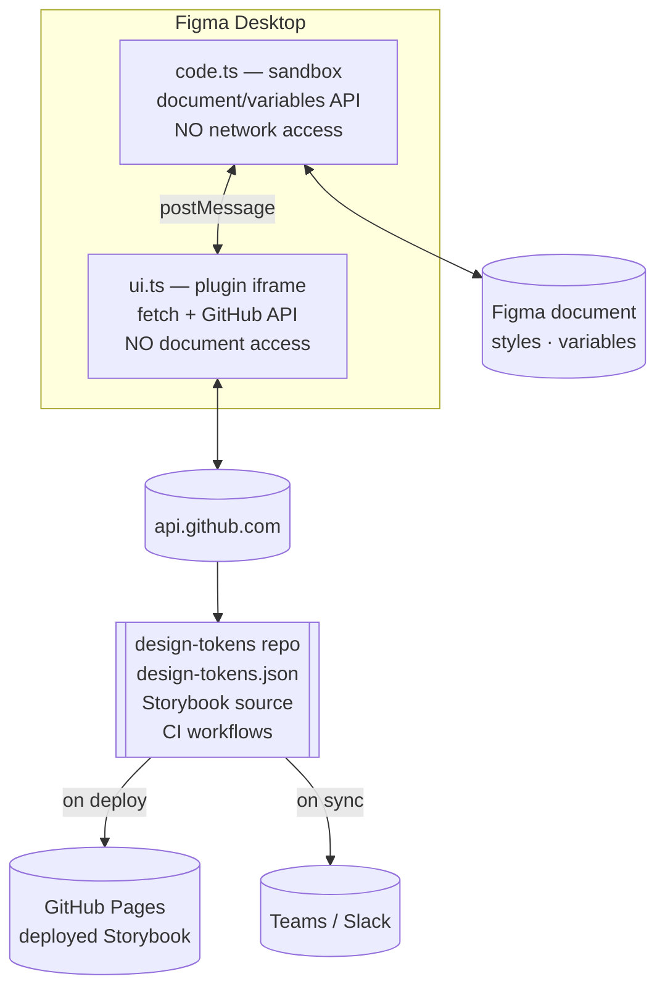
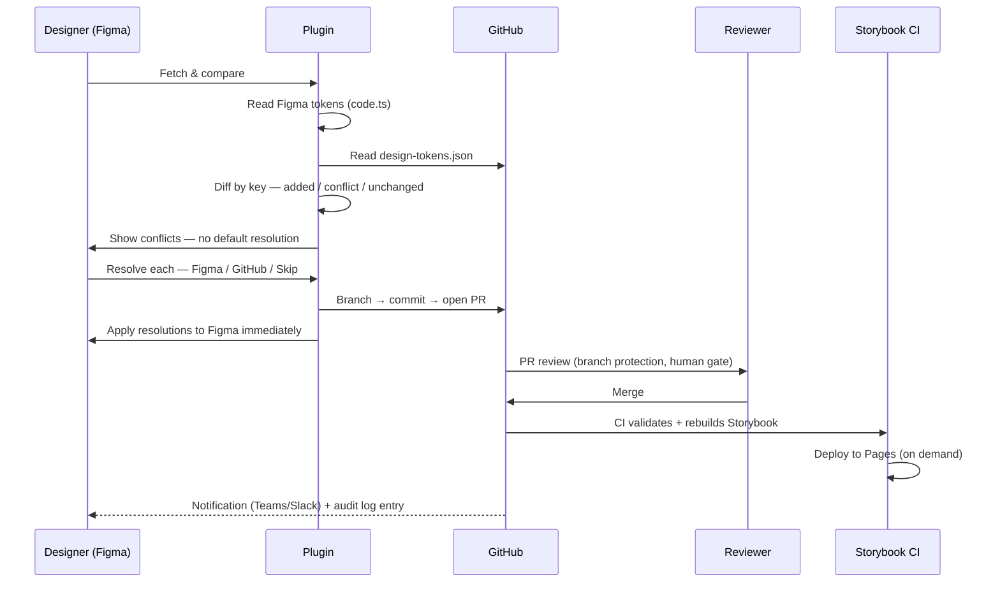
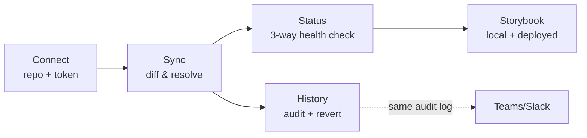
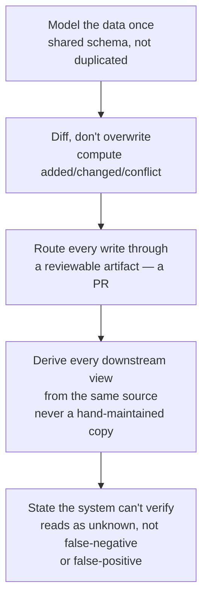

# Design Sync — Process & Architecture Brief

*For design/eng leads evaluating or replicating this pattern. Figma ⇄ GitHub ⇄ Storybook, kept in sync by a governed, auditable pipeline — not a common setup yet, so this documents the actual mechanics, not just the outcome.*

---

## 1. The idea, in one sentence

**GitHub is the single source of truth. Figma and Storybook both *reflect* it, through a reviewed, revertable pipeline — never through manual copy/paste.**

Most teams solve "Figma and code disagree" by having someone manually re-type values. That doesn't scale past a few dozen tokens and leaves zero history. This replaces that with the same governance model engineers already trust for code: **diff → review → merge → deploy.**

---

## 2. System architecture

**Why split across two sandboxes:** this is a Figma platform constraint, not a design choice — a plugin's document-access context and its network-access context are two separate, mutually exclusive runtimes. Every feature in this system has to cross that boundary via message-passing. Anything claiming to be a "Figma sync tool" that doesn't account for this split hasn't actually tried to ship one.

**Two repos, one schema.** The plugin repo and the tokens repo never share code directly — they share one published package (`design-sync-schema`) that defines the token shape and resolution logic once, so the two can't drift out of agreement with each other.

---

## 3. The end-to-end process

This is the part most teams haven't seen before — token sync treated as a **git workflow**, not a live two-way binding.

Three decisions that make this actually governed, not just automated:

| Decision | Why |
|---|---|
| **No default conflict resolution** | Auto-picking a side on a real conflict is how silent regressions happen. Every conflict blocks until a human picks. |
| **Figma updates immediately, GitHub waits for review** | Figma is a local working file — nothing to protect there. GitHub is the shared source of truth — that's what the PR gate protects. |
| **Every sync is a PR, never a direct commit** | Free rollback (revert the PR), free audit trail (the PR *is* the record), free CI hook (PR triggers validate + rebuild). |

---

## 4. How everything links

One data model, five views onto it — no view owns its own copy of the truth:

- **Connect** — where the repo/token live (`figma.clientStorage`, machine-local).
- **Sync** — the loop in §3.
- **Status** — reads three states at once (Figma↔GitHub diff, GitHub↔Storybook marker, GitHub↔Pages deployment) and never asserts something it can't confirm — a check that fails reads as *"can't confirm"*, never as a false *"definitely broken."*
- **History** — the append-only audit log every sync writes to; the same log both the Status/Notify hooks and a human "who changed this" question read from.
- **Storybook** — generated straight from `design-tokens.json` on every CI run; never hand-edited, so it can't drift from the source file by definition.

---

## 5. Design process — condensed

Not a discovery-to-delivery narrative. The mechanics that mattered:

1. **Audit against real data, not a demo set.** The token file this was built against has 5,470 colors, 6,030 dimensions, 137 typography styles. Every UI decision was pressure-tested at that scale before being called done — a grouping/pagination rule that "looks fine" with 40 items is a different problem at 5,000.
2. **Every UI state maps to a real data state, not a guess.** "Storybook might be stale" isn't a copywriting problem — it's `githubSha !== storybookMarker.tokensBlobSha`, computed, not assumed.
3. **Progressive disclosure, driven by the same state machine as everything else.** Collapsed-by-default sections use the app's own persisted state, not native browser widget state — because native disclosure state doesn't survive a full re-render, and this app re-renders on every change. (A real bug, found and fixed app-wide from one root cause.)
4. **State honesty over optimistic UI.** A capability the plugin can't perform (starting a local server, enabling GitHub Pages — both blocked by the sandbox in §2) is never faked. The UI shows exactly what it can't do and hands off the exact command/step needed instead.

---

## 6. The replicable pattern

If you're building something in this space — sync between a design tool and a code repo — this is the shape that held up:

The generalizable part isn't the Figma-specific plumbing — it's treating **design tokens as versioned data with a review gate**, the same trust model already used for code. Most teams haven't applied that model to design tokens yet; that's the actual gap this fills.

---

## 7. What's proven vs. what's scoped

| # | Capability | State |
|---|---|---|
| 1 | Token model (6 categories, reference-preserving) | ✅ Proven |
| 2 | Bidirectional Figma Variable write-back | ✅ Proven |
| 3 | PR-gated sync (no direct commits) | ✅ Proven |
| 4 | CI validation + Storybook build/deploy | ✅ Proven |
| 5 | Audit trail + per-token rollback | ✅ Proven |
| 9 | Notifications on sync events | ✅ Proven (partial — a static status-page variant was tried and deliberately dropped) |
| 6, 8 | Multi-brand routing, cross-platform (Style Dictionary) output | Scoped, not built — no confirmed need yet |
| 7, 10, 11 | AI-assisted conflict detection, team backend, drift detection in consuming code | Scoped, deliberately sequenced last |

**Read this as a working proof of concept for the trust model, not a finished platform.** The core loop (§3) is what needed to be proven first — everything else compounds on top of it once a real need shows up, not before.
