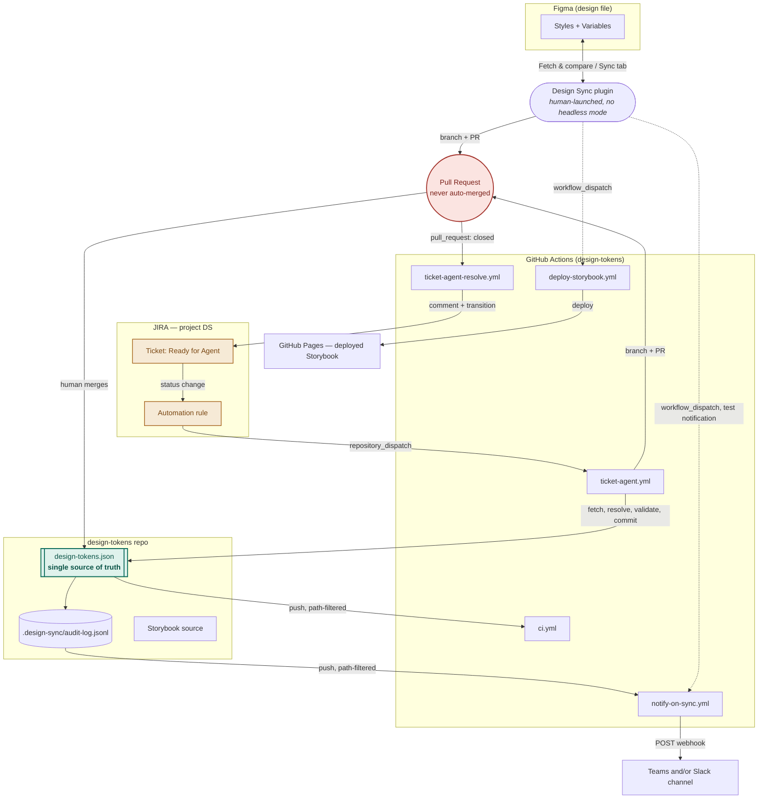
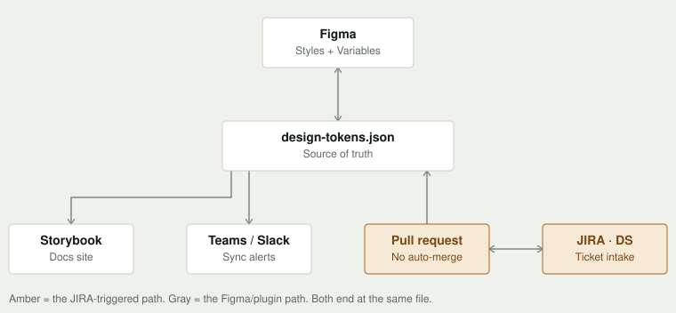
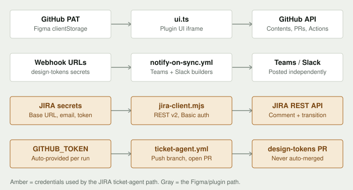

# Design Sync — High-Level Design

System design view: components, deployment, data flow, integrations, and a
full setup runbook. Companion to [LLD.md](LLD.md) (data models, state
machines, API contracts, algorithms) and [SYSTEM-REFERENCE.md](SYSTEM-REFERENCE.md)
(prose walkthrough). As of 2026-08-12, plugin v1.20.0.

---

## 1. Goals and non-goals

**Goals**
- One file, `design-tokens.json`, is the only durable state in the system —
  every surface either reads it, writes it (via a reviewed PR), or reacts to
  it changing.
- A design token change can originate from three independent places —
  a designer in Figma, a manual GitHub edit, or a JIRA ticket — and all
  three converge on the same file through the same review gate.
- No component holds standing write access without a human review step in
  between. No exceptions, regardless of who or what proposed the change.

**Non-goals (deliberate, not gaps)**
- No headless/background execution of the Figma plugin — out of reach on a
  non-Enterprise Figma plan; every Figma-side read or write needs a human
  to have the file open.
- No auto-merge, anywhere, for any actor (human-authored or agent-authored
  PRs alike).
- No natural-language ticket interpretation — JIRA tickets must use a fixed
  structured format; free text is parked as a scoped future increment.

---

## 2. Actors

| Actor | Role |
|---|---|
| **Designer** | Opens the Figma plugin, resolves conflicts, triggers a Sync-tab PR. |
| **Reviewer** | Any human with GitHub write access to `design-tokens`; merges or closes every PR the system produces. |
| **Ticket reporter** | Files a JIRA ticket in the `DS` project describing a token change, without touching Figma or GitHub directly. |
| **CI (GitHub Actions)** | Not a human actor, but treated as one architecturally — it validates, deploys, notifies, and runs the ticket agent, always inside the boundary of a specific workflow's declared permissions. |

---

## 3. System context



Solid arrows are automatic (fired by a push, webhook, or merge). Dotted
arrows are the two manual triggers in the whole system — a human clicking
"Rebuild Storybook" or "Send test notification" in the plugin's Status tab.

**Quick visual** (static SVG, renders anywhere — no Mermaid support needed):



---

## 4. Component inventory

| Component | Runtime | Repo | Responsibility |
|---|---|---|---|
| `code.ts` | Figma plugin sandbox | `Figma-Github Sync` | `figma.*` document API, `figma.clientStorage`, `figma.openExternal()`. No network access — categorical platform limitation, not a style choice. |
| `ui.ts` | Plugin UI iframe (sandboxed browser) | `Figma-Github Sync` | `fetch()`, all GitHub API calls, the diff engine, conflict resolution UI, branch/PR flow, local Storybook reachability probe, renders all 5 tabs. No `figma.*` document access. |
| `shared/tokens.ts` | Both of the above | `Figma-Github Sync` | Re-exports the token schema from `design-sync-schema`; defines the `postMessage` protocol and plugin-local types (`GithubSettings`, `SyncHistoryEntry`, `StorybookSyncMarker`). |
| `design-sync-schema` | npm package (`github:` dependency) | separate package, imported by both repos | `TokenSet`, `DesignToken<T>`, `resolveToken`, `validateTokenSet`, legacy-shape normalizer — the one place the token schema is defined, so a fix only happens once. |
| `design-tokens.json` | Static file | `design-tokens` | The system's only durable state. |
| `.design-sync/audit-log.jsonl` | Append-only file | `design-tokens` | One line per sync event; the event source for notifications. |
| `scripts/validate-tokens.mjs` | Node, invoked by CI and the ticket agent | `design-tokens` | Schema, reference-cycle, and shadow-layer validation. Exit code gates commits. |
| `scripts/jira-client.mjs` | Node module | `design-tokens` | Three functions (`getIssue`, `addComment`, `transition`) shared by both ticket-agent workflows. JIRA REST **v2**, HTTP Basic auth. |
| `scripts/ticket-agent.mjs` | Node, run by `ticket-agent.yml` | `design-tokens` | Fetch → parse → resolve → validate → branch → commit → PR. Never guesses; bounces to JIRA on any ambiguity. |
| `scripts/ticket-agent-resolve.mjs` | Node, run by `ticket-agent-resolve.yml` | `design-tokens` | Reads the closed PR's outcome, transitions the originating ticket. |
| `scripts/notify-on-sync.mjs` | Node, run by `notify-on-sync.yml` | `design-tokens` | Extracts new audit-log entries (or builds a fixed test message), posts to Teams and/or Slack independently. |
| `scripts/record-sync-marker.mjs` | Node, Storybook postbuild hook | `design-tokens` | Stamps `.storybook-sync.json` with the git blob SHA of `design-tokens.json` at build time. |
| Storybook | Static site build | `design-tokens` | 4 pages (Colors, Typography, Shadows, Dimensions) rendered from `design-tokens.json`. |

---

## 5. Deployment view

| Component | Executes on | Trigger | Lifetime |
|---|---|---|---|
| Plugin (`code.ts` + `ui.ts`) | Figma Desktop, inside the Figma process | Human launches it from Plugins → Development | Only while the plugin window is open |
| `ci.yml`, `deploy-storybook.yml`, `notify-on-sync.yml`, `ticket-agent.yml`, `ticket-agent-resolve.yml` | GitHub-hosted Actions runners (`ubuntu-latest`) | push / `workflow_dispatch` / `repository_dispatch` / `pull_request: closed` | One run per trigger, torn down after |
| Storybook (deployed) | GitHub Pages | Deploy step of `deploy-storybook.yml` | Static, persists until next deploy |
| JIRA Automation rule | Atlassian Cloud (`epam-ai-ux.atlassian.net`) | Ticket transitions to "Ready for Agent" | Always-on, JIRA-hosted |
| Teams/Slack webhook receiver | Microsoft/Slack-hosted | Incoming POST from `notify-on-sync.mjs` | Always-on, provider-hosted |

There is **no standing backend service** anywhere in this system — every
piece of compute is either a short-lived Actions runner or code running
inside a human's own Figma session. This is a deliberate architectural
constraint (see roadmap Phase 10, "Enterprise backend and platform layer" —
explicitly not started, priority "Medium — not now").

---

## 6. The four data flows

Detailed sequence diagrams for each of these live in **[LLD.md §5](LLD.md#5-sequence-diagrams)**.
This section gives the one-line shape of each.

1. **Figma ↔ GitHub sync** (plugin, human-triggered) — read both sides, diff,
   resolve conflicts, open a PR, apply GitHub's side back to Figma
   immediately (does not wait for the PR to merge).
2. **Storybook deploy** (CI, manually triggered from the plugin, or
   `workflow_dispatch`) — rebuild, stamp the sync marker, deploy to Pages.
3. **Sync notification** (CI, automatic on push to the audit log, or a
   manual test trigger) — extract new entries, post to Teams and/or Slack
   independently, each with a provider-specific payload shape.
4. **JIRA ticket → PR → JIRA** (CI, automatic on ticket transition and on PR
   close) — fetch, parse, resolve against the real file, validate, branch,
   commit, open a PR; report the PR's eventual outcome back to the ticket.

---

## 7. Integration and credential matrix

| Integration | Protocol | Auth | Credential storage | Scope |
|---|---|---|---|---|
| Plugin → GitHub | REST (Contents, Pull Requests, Actions, Pages APIs) | Fine-grained PAT | Figma `clientStorage`, per machine | Contents R/W, Pull requests R/W, Actions R/W, Pages read-only |
| `notify-on-sync.yml` → Teams | HTTPS POST, Adaptive Card JSON | Webhook URL (bearer-in-URL) | `design-tokens` repo secret `TEAMS_WEBHOOK_URL` | Post-only, one channel |
| `notify-on-sync.yml` → Slack | HTTPS POST, `{text}` JSON | Webhook URL | `design-tokens` repo secret `SLACK_WEBHOOK_URL` | Post-only, one channel |
| `ticket-agent.mjs` / `ticket-agent-resolve.mjs` → JIRA | REST API v2 | HTTP Basic (`email:apiToken`) | `design-tokens` repo secrets `JIRA_BASE_URL`, `JIRA_EMAIL`, `JIRA_API_TOKEN` | Read issue, write comment, transition status — no admin scopes |
| JIRA Automation rule → GitHub | REST, `POST /repos/{owner}/{repo}/dispatches` | Fine-grained PAT, one-way | Pasted directly into the Automation rule's web-request header (JIRA-side, not a GitHub secret) | Contents: Read and write, scoped to `design-tokens` only |
| `ticket-agent.yml` / `ticket-agent-resolve.yml` → GitHub (push branch, open PR) | git + REST (via `gh` CLI) | Built-in `secrets.GITHUB_TOKEN` | Auto-provided per workflow run, never stored | Declared in-workflow: `contents: write`, `pull-requests: write` |
| `deploy-storybook.yml` → GitHub Pages | `actions/deploy-pages` | Built-in `secrets.GITHUB_TOKEN` + OIDC | Auto-provided | `pages: write`, `id-token: write` |

**Why the JIRA Automation rule's GitHub token is a separate credential from
`GITHUB_TOKEN`:** it fires the *first* call, from outside GitHub entirely —
nothing inside GitHub exists yet to provide a token at that point. Every
subsequent GitHub-side action in the pipeline runs inside a workflow and
uses the auto-provided token instead.

**Quick visual** — every credential, what stores it, what consumes it, and
what it authenticates to:



**No GitHub App exists anywhere in this system.** Every GitHub-side write
(sync PRs, agent PRs, Pages deploys) uses either a user's own fine-grained
PAT or the workflow-scoped `GITHUB_TOKEN` — both sufficient because nothing
in this system merges a PR programmatically. A future auto-merge/governance
agent (roadmap Phase 19) would need a GitHub App identity specifically
because merging is a higher-privilege action than opening; that agent does
not exist yet.

---

## 8. Non-functional design decisions

**Security boundary — the sandbox/iframe split.** `code.ts` has full Figma
document access and zero network access; `ui.ts` has `fetch()` and zero
document access. This is a hard Figma platform constraint, not a stylistic
choice — any capability needing both must cross via `postMessage` (see
LLD §2 for the exact message shapes). No exception has ever been made to
this rule across 24 roadmap phases.

**The no-auto-merge guardrail.** Every PR this system opens — Sync-tab or
JIRA-agent — waits for an explicit human merge. The risk managed is
*interpretation* risk (was the change understood correctly), not
*change-size* risk, so there is no "small enough to auto-merge" carve-out
anywhere in the codebase.

**Scale limits already hit in production use** (this project's own test
data is EPAM UUI's ~11,600-entry theme system):
- GitHub Contents API inlines file content only under 1MB — reads above
  that use `Accept: application/vnd.github.raw+json`.
- `figma.root.setSharedPluginData` caps each entry at 100kB.
- Storybook currently bundles the full token JSON at build time (~5MB) —
  acceptable today, flagged as a future runtime-fetch candidate if the
  token set grows substantially further.

**Reliability posture.** Two of the six workflows are deliberately manual
(`deploy-storybook.yml`'s trigger, `notify-on-sync.yml`'s test-message
mode) — rebuilding/deploying is a reviewed human action, not a blind side
effect of every push. The other four are fully automatic and idempotent
per-trigger.

**Availability.** No standing service to go down. The plugin works whenever
Figma is open; GitHub Actions, JIRA Cloud, and Teams/Slack are all
third-party-hosted with their own SLAs — this system adds no new
single point of failure beyond those.

---

## 9. Setup runbook

Full, redoable setup steps for every integration, as if starting from zero.

### 9.1 `design-tokens` GitHub repo

1. Create (or use) the repo. Add `design-tokens.json` at the root — an
   empty `{}` is valid; the plugin populates it on first sync.
2. **Repo secrets** — Settings → Secrets and variables → Actions →
   New repository secret:
   | Name | Value |
   |---|---|
   | `TEAMS_WEBHOOK_URL` | from §9.3 below (optional) |
   | `SLACK_WEBHOOK_URL` | from §9.4 below (optional) |
   | `JIRA_BASE_URL` | e.g. `https://your-site.atlassian.net` |
   | `JIRA_EMAIL` | the Atlassian account email tied to the API token |
   | `JIRA_API_TOKEN` | from §9.5 step 2 below |
3. **Repo variable** (not a secret) — Settings → Secrets and variables →
   Actions → Variables tab → `NOTIFY_TIMEZONE` = an IANA zone name (e.g.
   `Asia/Kolkata`). Optional; notifications fall back to labeled UTC if unset.
4. **Actions permissions** — Settings → Actions → General → Workflow
   permissions → check **"Allow GitHub Actions to create and approve pull
   requests."** Off by default; without it, `gh pr create` fails at the
   very last step of the ticket agent, after everything else already
   succeeded.
5. **Pages** — Settings → Pages → Source → **GitHub Actions** (required for
   `deploy-storybook.yml`'s `actions/deploy-pages` step to publish).
6. Commit the five workflow files and five scripts listed in §4 above (already
   present in this repo if you're reading this from a working setup).

### 9.2 Figma plugin — Connect tab

1. GitHub → Settings → Developer settings → Fine-grained personal access
   tokens → Generate new token, scoped to just `design-tokens`, with:
   - **Contents**: Read and write
   - **Pull requests**: Read and write
   - **Actions**: Read and write (only needed for the Status tab's "Rebuild
     Storybook" / "Send test notification" buttons)
   - **Pages**: Read-only (only needed to check whether a deployed Storybook
     build exists)
2. Figma Desktop → Plugins → Development → Import plugin from manifest →
   select this repo's `manifest.json`.
3. Launch the plugin → Connect tab → paste owner/repo/branch/path, paste the
   token → Connect. The token is stored only in `figma.clientStorage`
   (per machine) and only ever sent to `api.github.com`.

### 9.3 Microsoft Teams webhook

1. In the target Teams channel: **⋯ → Workflows** (or **Connectors** on
   older tenants) → search "Webhook" → **When a Teams webhook request is
   received**.
2. Name it, create it, copy the generated URL.
3. Add it as the `TEAMS_WEBHOOK_URL` repo secret (§9.1 step 2).
4. Verify: Figma plugin → Status tab → "Send test notification" (fires
   `notify-on-sync.yml` via `workflow_dispatch`) — confirm the test card
   arrives in the channel. Note: Teams' webhook trigger returns success as
   soon as it *accepts* the request, before the flow has actually run — a
   2xx from `notify-on-sync.mjs`'s POST does not by itself guarantee
   delivery; check the flow's own run history if a message doesn't appear.

### 9.4 Slack webhook

1. Slack → **api.slack.com/apps** → Create New App → From scratch.
2. **Incoming Webhooks** → toggle on → **Add New Webhook to Workspace** →
   pick the channel → copy the URL.
3. Add it as the `SLACK_WEBHOOK_URL` repo secret.
4. Verify the same way as §9.3 step 4.

Teams and Slack are independent and optional — set either, both, or
neither. `notify-on-sync.mjs` builds a genuinely different payload shape
for each (Adaptive Card vs. plain `{text}`), so both can be wired up
simultaneously without conflict.

### 9.5 JIRA

1. Create (or use) a site, e.g. `your-site.atlassian.net`, and a
   Team-managed project (this system uses project key `DS`).
2. **API token** — Atlassian account → Security → Create and manage API
   tokens → Create API token. This is the value for `JIRA_API_TOKEN`.
3. **Workflow / statuses** — ensure the project's workflow includes, at
   minimum: a status that means "ready for the agent to act" and a status
   the agent can bounce back to for revision. This system uses:
   `To Do → In Design → Ready for Agent → In Review → Live`.
4. **Automation rule** — Project settings → Automation → Create rule:
   - **Trigger**: "Work item transitioned" → to status **Ready for Agent**.
     (Search "transition," not "issue" — newer JIRA UI labels this
     "Work item," not "Issue.")
   - **Action**: "Send web request" →
     `POST https://api.github.com/repos/{owner}/design-tokens/dispatches`
     with body:
     ```json
     {
       "event_type": "jira-ticket-ready",
       "client_payload": {
         "issueKey": "{{issue.key}}",
         "issueSummary": "{{issue.summary}}"
       }
     }
     ```
     **Use JIRA's own `{}` smart-value picker** to insert `issue.key` /
     `issue.summary` — typing the placeholder text by hand and forgetting
     to replace it sends the literal string as the issue key, which
     surfaces as a confusing `404 Issue does not exist` from GitHub.
     Headers: `Content-Type: application/json`,
     `Authorization: Bearer <fine-grained PAT, Contents: Read and write,
     scoped to design-tokens>`, `Accept: application/vnd.github+json`.
5. **Test**: file a ticket with the structured format (see
   [LLD.md §4.5](LLD.md#45-jira-rest-api-v2)), move it to "Ready for Agent,"
   watch the `design-tokens` repo's Actions tab for the `ticket-agent.yml`
   run, confirm a PR opens and the ticket's status/comments update.

---

## 10. Document map

| Document | Covers |
|---|---|
| **HLD.md** (this file) | System design — components, deployment, integrations, setup |
| [LLD.md](LLD.md) | Low-level design — data models, state machines, API contracts, algorithms, sequence diagrams |
| [SYSTEM-REFERENCE.md](SYSTEM-REFERENCE.md) | Prose end-to-end walkthrough + edge-case tables |
| [README.md](README.md) | Plugin build/run instructions, token model summary |
| [design-sync-roadmap-phases-1-11.md](design-sync-roadmap-phases-1-11.md) | Full phase-by-phase product spec, historical decisions, priorities |
| `JIRA-AGENT.md` (in `design-tokens` repo) | JIRA agent-specific deep dive, written from that repo's side |
