# Design Sync — Low-Level Design

Data models, state machines, API request/response contracts, algorithms, and
detailed sequence diagrams. Companion to [HLD.md](HLD.md) (system design,
setup runbook). No source code is reproduced verbatim below — type shapes
and function behavior are documented from the real, current implementation
as of 2026-08-12 (plugin v1.20.0).

---

## 1. Data models

### 1.1 Token schema (`design-sync-schema` package — shared by both repos)

```ts
type TokenCategory = 'color' | 'typography' | 'shadow' | 'dimension' | 'string' | 'boolean';

type TokenValue<T> =
  | { kind: 'value'; value: T }
  | { kind: 'reference'; refKey: string };   // '<category>/<key>', e.g. "color/primitive/blue-600"

interface DesignToken<T> {
  $type: TokenCategory;
  $value: TokenValue<T>;
  $description?: string;
  $extensions?: {
    'design-sync.figmaSourceType'?: 'style' | 'variable';
    'design-sync.variableId'?: string;   // stable re-link target for write-back
  };
}

interface TypographyValue {
  fontFamily: string;
  fontStyle: string;
  fontSize: number;
  lineHeight: { value: number; unit: 'PIXELS' | 'PERCENT' | 'AUTO' };
  letterSpacing: { value: number; unit: 'PIXELS' | 'PERCENT' };
}

interface ShadowLayer {
  type: 'DROP_SHADOW' | 'INNER_SHADOW';
  color: string;
  offsetX: number; offsetY: number; blur: number; spread: number;
}

interface TokenSet {
  color:      Record<string, DesignToken<string>>;
  typography: Record<string, DesignToken<TypographyValue>>;
  shadow:     Record<string, DesignToken<ShadowLayer[]>>;
  dimension:  Record<string, DesignToken<string>>;
  string:     Record<string, DesignToken<string>>;
  boolean:    Record<string, DesignToken<boolean>>;
}
```

Key design point: `$value` is a discriminated union, not a bare value. A
token is *either* a concrete value *or* a pointer to another token —
aliasing is first-class, not resolved-away at read time. `resolveToken()`
walks a `reference` chain to its concrete value on demand; every consumer
that needs an actual usable value (the diff engine, Storybook, the JIRA
agent) calls through this resolver rather than reading `$value` directly.

### 1.2 Plugin-local types (`shared/tokens.ts`, `Figma-Github Sync` repo)

```ts
interface GithubSettings {
  owner: string; repo: string; branch: string; path: string; token: string;
}

interface SyncHistoryEntry {
  timestamp: string;   // ISO 8601
  prNumber: number;
  prUrl: string;
  branch: string;       // the head branch the PR was opened from
}

interface StorybookSyncMarker {
  tokensBlobSha: string;   // git blob SHA of design-tokens.json at build time
  builtAt: string;          // ISO 8601
}
```

`StorybookSyncMarker.tokensBlobSha` is deliberately the *git blob SHA* —
identical in format to what GitHub's Contents API reports for the same
file — so "is Storybook stale" is a plain string comparison, needing no
live Storybook deployment to be reachable.

### 1.3 `postMessage` protocol (`code.ts` ↔ `ui.ts`)

This is the *only* channel between the two plugin halves — the sandbox/
iframe split (HLD §8) has no other communication path.

```ts
type UIToPluginMessage =
  | { type: 'ui-ready' }
  | { type: 'save-settings'; settings: GithubSettings }
  | { type: 'request-figma-tokens' }
  | { type: 'save-custom-tokens'; dimension: Record<string, DimensionToken>;
                                    string: Record<string, StringToken>;
                                    boolean: Record<string, BooleanToken> }
  | { type: 'apply-tokens'; tokens: TokenSet }
  | { type: 'save-history'; entry: SyncHistoryEntry }
  | { type: 'open-external'; url: string }
  | { type: 'save-dismissed-update-version'; version: string };

type PluginToUIMessage =
  | { type: 'init'; settings: GithubSettings | null; history: SyncHistoryEntry[];
      dismissedUpdateVersion: string | null }
  | { type: 'figma-tokens'; tokens: TokenSet }
  | { type: 'figma-tokens-error'; error: string }
  | { type: 'apply-tokens-result'; success: boolean; error?: string; diagnostics?: string[] };
```

`apply-tokens-result.diagnostics` is one line per color/dimension/string/
boolean token processed during write-back, recording whether it wrote to a
real Figma Variable or fell back to a Style/plugin-data blob, and why —
without this, a silent variable-write failure (wrong `$extensions`, a
deleted variable, a remote/library variable the plugin API won't let a
plugin edit) is indistinguishable from "nothing needed to change" by
looking at Figma alone.

### 1.4 Audit log entry (`.design-sync/audit-log.jsonl`, one JSON object per line)

```ts
interface AuditEntry {
  timestamp: string;
  actor: string;
  prNumber: number;
  prUrl: string;
  changes: {
    category: TokenCategory;
    key: string;
    previousValue: DesignToken<unknown> | undefined;   // full token object, not a bare scalar
    newValue: DesignToken<unknown> | undefined;
  }[];
}
```

`previousValue`/`newValue` store the **full `DesignToken` object**
(`{$type, $value: {kind, value|refKey}, $extensions}`), not a bare scalar —
`notify-on-sync.mjs`'s `resolvedValueOf()` unwraps this for display,
rendering a reference as `→ category/key` rather than trying to show a
resolved value that may not even be a scalar.

---

## 2. State machines

### 2.1 JIRA ticket status

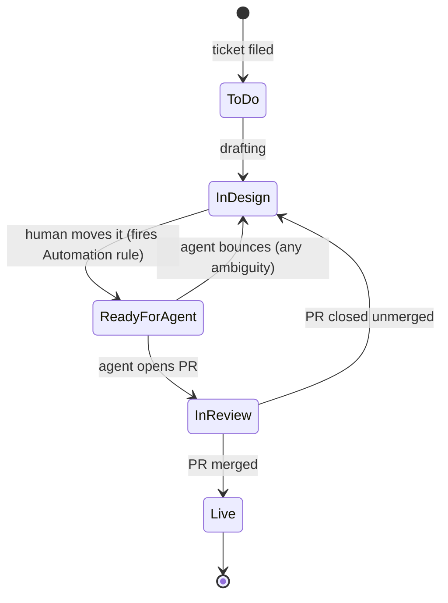

`In Design` is reused for two different meanings — "still being drafted"
and "the agent's clarification-needed bounce target" — deliberately, rather
than adding a distinct "Needs Info" status. `Live` has no further outgoing
transition modeled here; a follow-up change to the same token starts a new
ticket. "Approved" as a distinct status between merge and live was
considered and dropped — Storybook's auto-deploy is close enough to
instant that it added no real signal.

### 2.2 Pull request lifecycle (both origins — Sync tab and ticket agent)

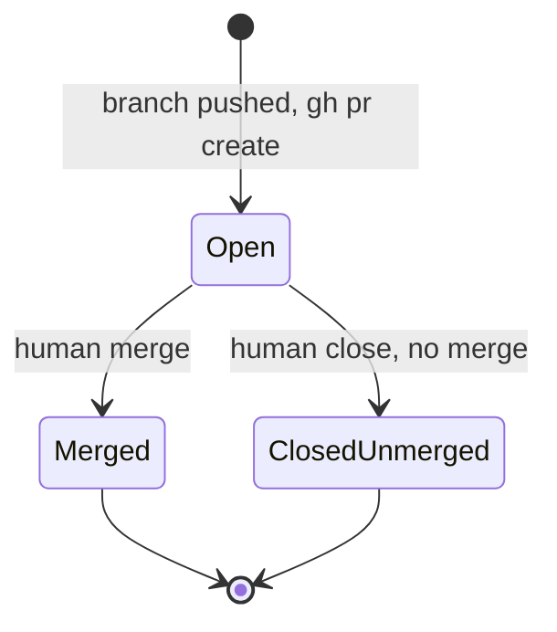

No state in this machine is ever entered programmatically except `Open`.
`Merged` and `ClosedUnmerged` require a human action on GitHub; nothing in
either repo calls a merge API.

### 2.3 Sync-tab conflict resolution (per diff row, in-memory UI state only)

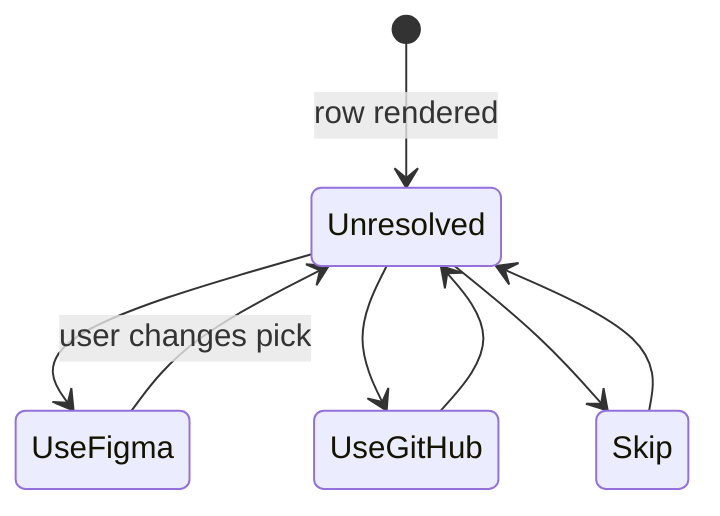

The Sync button stays disabled while any row is `Unresolved` — there is no
default resolution state; every conflicting key requires an explicit human
pick.

---

## 3. API contracts

### 3.1 GitHub Contents API (`ui.ts`)

| Call | Request | Response (relevant fields) |
|---|---|---|
| Read tokens file | `GET /repos/{owner}/{repo}/contents/{path}?ref={branch}`, header `Accept: application/vnd.github.raw+json` if the file is known to exceed 1MB | Raw file bytes (with the raw media type) or `{content (base64), sha}` (default media type, only reliable under 1MB) |
| Commit to a branch | `PUT /repos/{owner}/{repo}/contents/{path}` — body `{ message, content (base64), sha, branch }` | `{ commit: { sha, html_url }, content: { sha } }` |

### 3.2 GitHub Pull Requests API (`ui.ts` and `ticket-agent.mjs` via `gh` CLI)

| Call | Request | Response |
|---|---|---|
| Create branch | `POST /repos/{owner}/{repo}/git/refs` — `{ ref: "refs/heads/{branch}", sha: {baseSha} }` | `{ ref, object: { sha } }` |
| Open PR | `POST /repos/{owner}/{repo}/pulls` (or `gh pr create --title … --body … --base … --head …`) — `{ title, head, base, body }` | `{ number, html_url, state }` |
| Poll status (plugin) | `GET /repos/{owner}/{repo}/pulls?head={owner}:design-sync/*` | array of open PRs matching the plugin's own branch prefix |

### 3.3 GitHub Actions dispatch APIs

| Call | Trigger shape | Payload |
|---|---|---|
| Plugin → Storybook rebuild | `POST /repos/{owner}/{repo}/actions/workflows/deploy-storybook.yml/dispatches` | `{ ref: "main" }` |
| Plugin → test notification | `POST /repos/{owner}/{repo}/actions/workflows/notify-on-sync.yml/dispatches` | `{ ref: "main" }` |
| JIRA Automation → ticket agent | `POST /repos/{owner}/{repo}/dispatches` | `{ event_type: "jira-ticket-ready", client_payload: { issueKey, issueSummary } }` |

The third row is the one call that originates entirely outside GitHub — see
HLD §7 for why it carries its own, separate credential.

### 3.4 GitHub event payloads consumed by workflows

| Workflow | Trigger | Fields read |
|---|---|---|
| `ticket-agent.yml` | `repository_dispatch`, type `jira-ticket-ready` | `github.event.client_payload.issueKey` |
| `ticket-agent-resolve.yml` | `pull_request`, type `closed` | `github.event.pull_request.head.ref` (branch filter), `.html_url`, `.merged` |
| `notify-on-sync.yml` | `push` (path-filtered) or `workflow_dispatch` | `github.event_name` (selects real-summary vs. test-message mode) |

### 3.5 JIRA REST API v2

Chosen over v3 specifically because v2 accepts/returns `description` and
comment `body` as **plain strings**; v3 uses Atlassian Document Format (a
nested JSON tree) for the same fields, which would need its own parser for
no benefit here. Auth: HTTP Basic, `base64(email:apiToken)`, on every call.

| Call | Request | Response (relevant fields) |
|---|---|---|
| Get issue | `GET {baseUrl}/rest/api/2/issue/{key}?fields=summary,description` | `{ fields: { summary, description } }` |
| Add comment | `POST {baseUrl}/rest/api/2/issue/{key}/comment` — `{ body: "<text>" }` | `201`, comment object |
| List transitions | `GET {baseUrl}/rest/api/2/issue/{key}/transitions` | `{ transitions: [{ id, to: { name } }, …] }` |
| Execute transition | `POST {baseUrl}/rest/api/2/issue/{key}/transitions` — `{ transition: { id } }` | `204` |

**Transitions are addressed by numeric id, not status name** — every call
to `jira-client.mjs`'s `transition(statusName)` first lists the issue's
*currently available* transitions and matches by `to.name` (case-
insensitive), then posts using the matched id. If the requested status
isn't reachable from the ticket's current state, it throws with the full
list of what *is* available, rather than failing silently or attempting a
non-existent transition id.

**Structured ticket format** (parsed from the plain-string `description`):

```
Token: category/token-key
Current value: <exact current value>
New value: <the value to change it to>
Reason: <why — carried into the PR body>
```

Each field is extracted independently via
`^${label}:\s*(.+)$` matched case-insensitively and multiline against the
full description — order and surrounding text don't matter, only that each
labeled line exists somewhere in the body.

### 3.6 Teams webhook payload (Adaptive Card)

Built by `teamsAdaptiveCard()` in `notify-on-sync.mjs`. Microsoft's
"Post to a channel when a webhook request is received" template treats the
**entire POSTed JSON body** as the card to render — there is no envelope,
the body itself must already be `{"type": "AdaptiveCard", ...}`.

```json
{
  "type": "AdaptiveCard",
  "$schema": "http://adaptivecards.io/schemas/adaptive-card.json",
  "version": "1.4",
  "body": [
    { "type": "TextBlock", "text": "Design Sync: shivanshu synced 3 tokens", "weight": "Bolder", "size": "Medium", "wrap": true },
    { "type": "FactSet", "facts": [{ "title": "Actor", "value": "shivanshu" }, { "title": "When", "value": "Aug 12, 2026, 3:40 PM (Asia/Kolkata)" }] },
    { "type": "TextBlock", "text": "- color/brand/primary: #3678E2 → #2a5ec4\n\n- ...", "wrap": true, "isSubtle": true, "size": "Small" }
  ],
  "actions": [{ "type": "Action.OpenUrl", "title": "View pull request #41", "url": "https://github.com/…/pull/41" }]
}
```

### 3.7 Slack webhook payload

Built by `slackPayload()`. Slack's classic incoming webhook wants a flat
`{text}` shape — there is no shape that satisfies both providers at once,
which is why each gets its own independent payload builder fed by the same
neutral summary object.

```json
{ "text": "Design Sync: shivanshu synced 3 tokens\n\nActor: shivanshu · When: Aug 12, 2026, 3:40 PM (Asia/Kolkata)\n\n• color/brand/primary: #3678E2 → #2a5ec4\n\nView pull request #41: https://github.com/…/pull/41" }
```

A webhook POST failure to either provider (revoked URL, deleted flow) is
logged and swallowed, not thrown — the sync itself already succeeded and
merged; losing a notification is treated as strictly lower severity than
failing an otherwise-clean CI run.

---

## 4. Algorithms

### 4.1 Token diff (Sync tab, `ui.ts`)

Given `figmaTokens: TokenSet` and `githubTokens: TokenSet`, for each
category, for the union of keys on both sides:

| Condition | Classification |
|---|---|
| Key only in Figma | `added-figma` |
| Key only in GitHub | `added-github` |
| Key in both, `$value` differs | `modified` — no default resolution |
| Key in both, `$value` identical | not shown — unchanged |

### 4.2 Token path resolution and reference walk

Implemented three times independently (the plugin's `resolveToken()`,
`validate-tokens.mjs`'s `resolve()`, and `ticket-agent.mjs`'s `resolve()`) —
deliberately not shared, since `design-tokens` has no build step / shared
module boundary with the plugin repo, matching that repo's existing
convention.

```
parseRefKey(refKey):
  split refKey on the FIRST "/" only
  → { category: <before>, key: <everything after, including further "/"> }

resolve(tokens, category, key, visited=∅):
  visitKey = "{category}/{key}"
  if visitKey ∈ visited: throw "circular reference"
  visited.add(visitKey)
  token = tokens[category]?[key]
  if !token: throw "token not found"
  if token.$value.kind === 'value': return token.$value.value
  parsed = parseRefKey(token.$value.refKey)
  if !parsed: throw "malformed refKey"
  return resolve(tokens, parsed.category, parsed.key, visited)
```

The first-slash-only split matters because token keys routinely contain
further slashes themselves (e.g. `additional palette/yellow/yellow-5`) —
splitting on every slash would misparse the category boundary.

### 4.3 Branch naming and issue-key extraction

| Origin | Branch name | Regex used to recover the issue key |
|---|---|---|
| Sync tab | `design-sync/sync-{timestamp}` | n/a — this origin never reports back to JIRA |
| Ticket agent | `design-sync/agent-{ISSUE-KEY}-{timestamp}` | `^design-sync\/agent-([A-Za-z][A-Za-z0-9]*-\d+)-\d+$` |

The issue key is embedded in the branch name at creation time specifically
so `ticket-agent-resolve.mjs` can recover it from
`github.event.pull_request.head.ref` alone, with zero extra JIRA or GitHub
API round-trips.

### 4.4 New audit-log entry extraction (`notify-on-sync.mjs`)

```
previous = git show HEAD~1:.design-sync/audit-log.jsonl   (empty string if it doesn't exist yet)
previousLineCount = count of non-blank lines in `previous`
current = read the file now, split into non-blank lines
newLines = current[previousLineCount:]
```

Correct specifically because the audit log is **append-only** — it only
ever grows, so "lines beyond the previous commit's line count" is exactly
"what this push appended," with no need to diff content or track offsets.

### 4.5 Storybook staleness check (plugin's Status tab)

```
local  = record-sync-marker.mjs's stamped tokensBlobSha (from .storybook-sync.json, fetched from GitHub)
remote = GitHub Contents API's reported blob sha for design-tokens.json right now
stale  = local !== remote
```

No live Storybook deployment needs to be reachable for this comparison —
it's a pure string comparison between two SHAs already available over the
Contents API.

---

## 5. Sequence diagrams

### 5.1 Figma ↔ GitHub sync

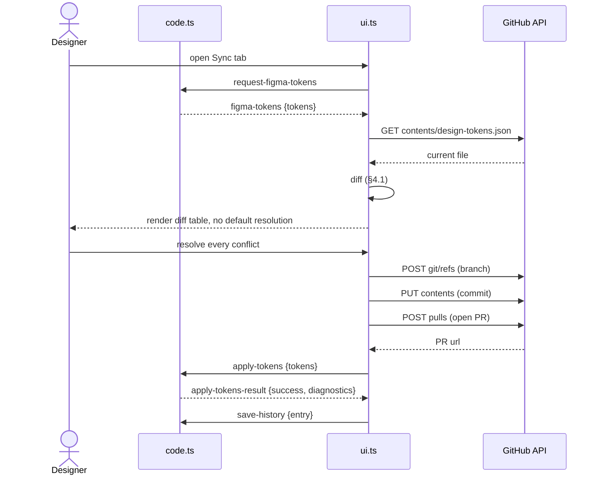

### 5.2 JIRA ticket agent — happy path

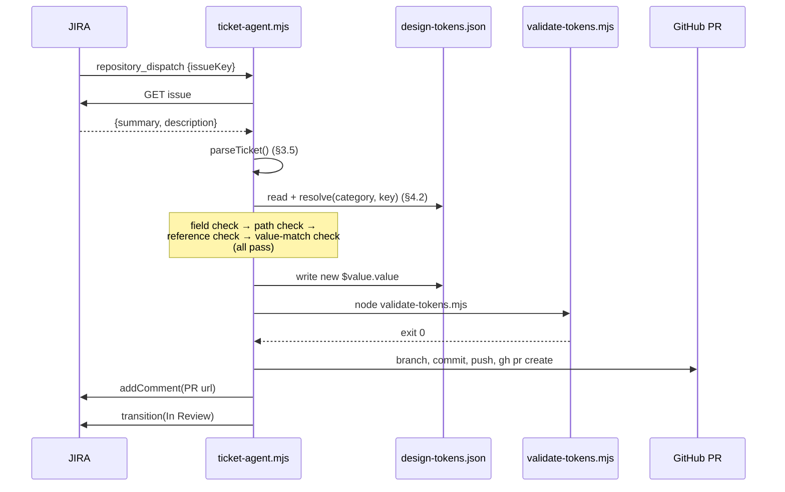

### 5.3 JIRA ticket agent — bounce path (any one of five checks fails)

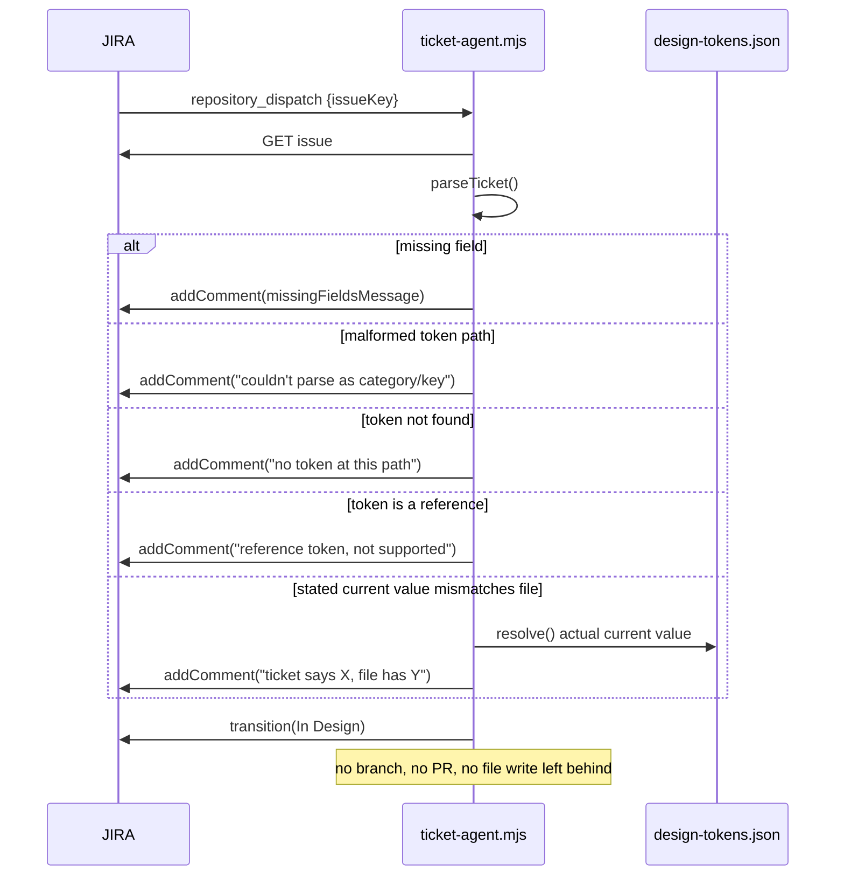

### 5.4 JIRA ticket agent — validation failure (a sixth, later failure point)

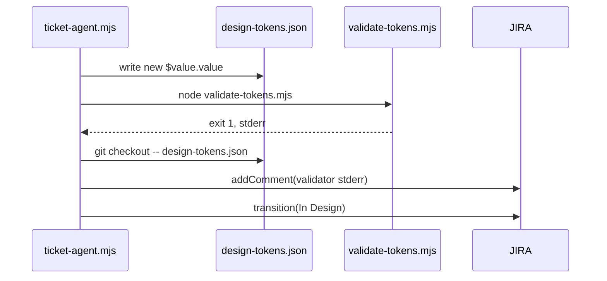

### 5.5 PR resolution — merged vs. closed unmerged

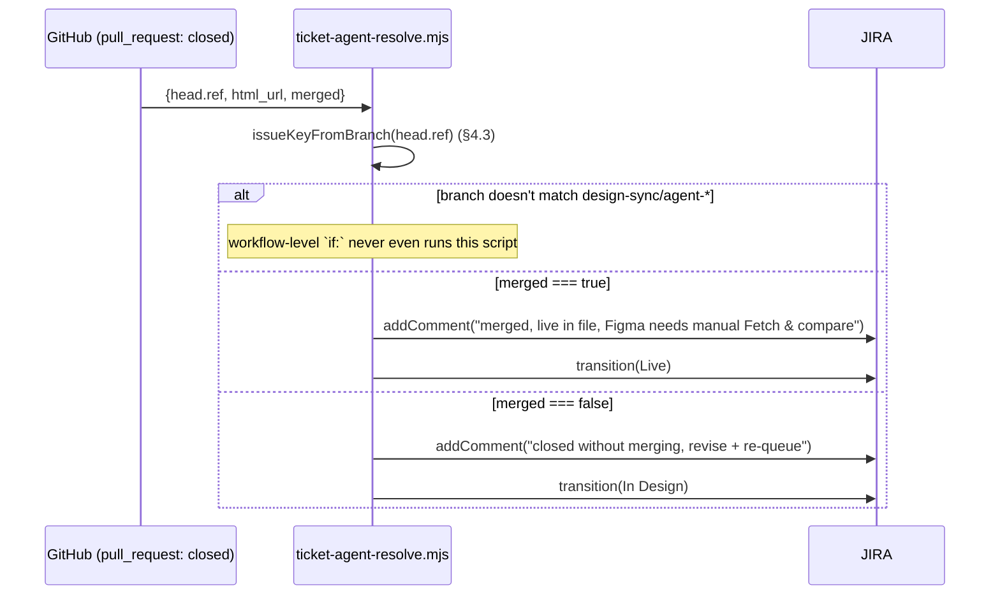

### 5.6 Notification (push-triggered vs. manual test)

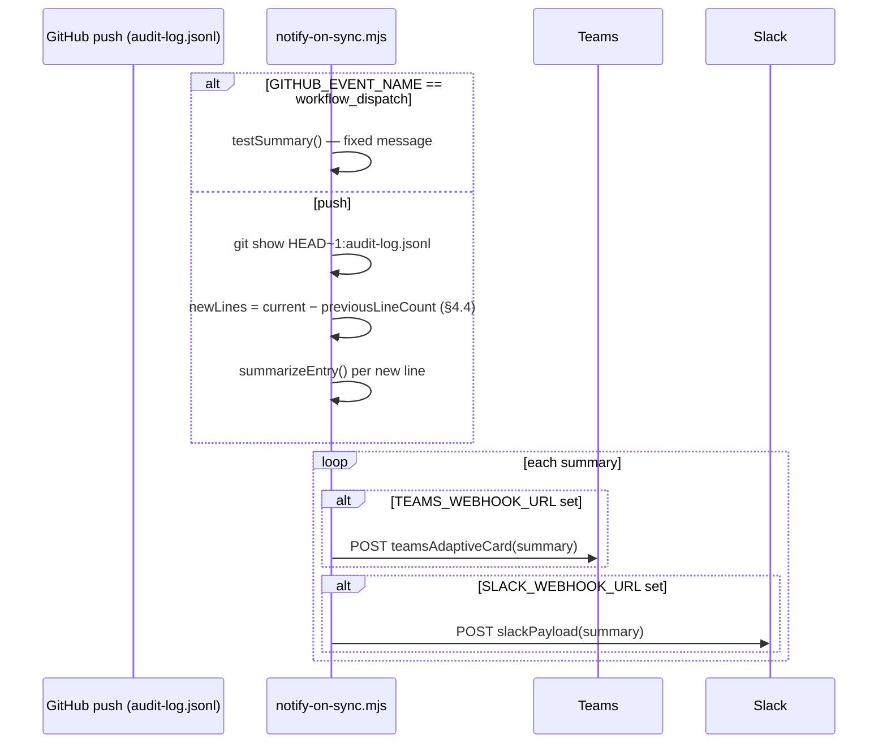

---

### 5.7 Quick visuals (static SVG, renders anywhere)

Figma ↔ GitHub sync, the same six steps as §5.1:

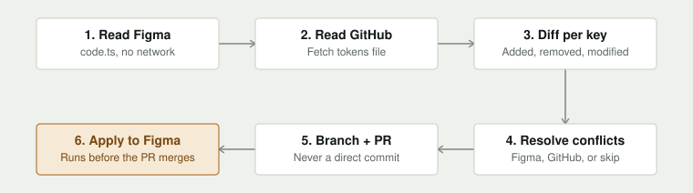

The JIRA agent's full decision tree — happy path, both bounce conditions,
and both PR outcomes in one diagram (covers §5.2–§5.5):

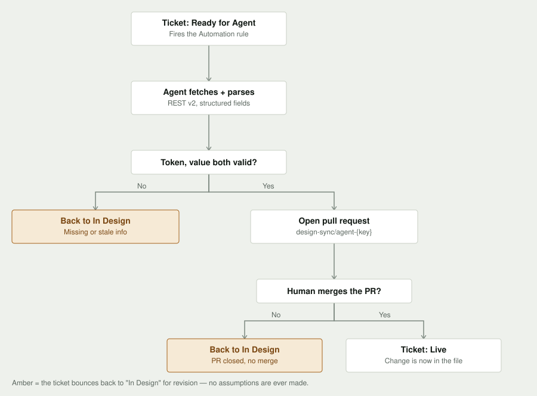

---

## 6. Module / function inventory

| File | Function | In → Out | Side effects |
|---|---|---|---|
| `scripts/jira-client.mjs` | `getIssue(baseUrl, email, token, key)` | issue key → `{summary, description}` | 1 GET |
| | `addComment(…, key, text)` | text → void | 1 POST |
| | `transition(…, key, statusName)` | status name → void | 1 GET + 1 POST; throws with available targets on no match |
| `scripts/ticket-agent.mjs` | `parseRefKey(refKey)` | `"cat/a/b"` → `{category, key}` or `null` | pure |
| | `resolve(tokens, category, key, visited)` | path → concrete value | pure; throws on missing/circular/malformed |
| | `parseTicket(description)` | raw text → `{tokenPath, currentValue, newValue, reason}` | pure |
| | `bounceForClarification(jira, key, message)` | message → void | 1 comment + 1 transition |
| | `main()` | env vars → process exit code | full pipeline: JIRA reads, file read/write, git, `gh` CLI, JIRA writes |
| `scripts/ticket-agent-resolve.mjs` | `issueKeyFromBranch(branch)` | branch name → issue key or `null` | pure |
| | `main()` | env vars → process exit code | 1 comment + 1 transition |
| `scripts/validate-tokens.mjs` | `resolve(category, key, visited)` | path → concrete value | pure; throws on error |
| | (module body) | file path arg → exit 0/1/2 | reads file, writes to stdout/stderr only — never mutates the token file |
| `scripts/notify-on-sync.mjs` | `resolvedValueOf(token)` | `DesignToken \| undefined` → display string | pure |
| | `changeLines(changes)` | change list → up to 12 formatted lines + overflow note | pure |
| | `teamsAdaptiveCard(summary)` / `slackPayload(summary)` | neutral summary → provider payload | pure |
| | `formatTimestamp(iso)` | ISO string → localized string | reads `NOTIFY_TIMEZONE` env |
| | `summarizeEntry(entry)` / `testSummary()` | audit entry (or nothing) → neutral summary | pure |
| | `post(url, payload)` | url + payload → void | 1 POST; logs and swallows failure, never throws |
| | `main()` | env vars + event name → process exit code | reads audit log, git show, up to 2 POSTs per summary |
| `scripts/record-sync-marker.mjs` | (module body) | none | reads `design-tokens.json`'s blob sha, writes `.storybook-sync.json` |

---

## 7. Error handling matrix

| Layer | Failure | Mechanism |
|---|---|---|
| `ui.ts` GitHub calls | Non-2xx response | Caught, surfaced as a specific message where the failure is scope-related (e.g. missing `pull_requests: write`), generic otherwise |
| `ticket-agent.mjs` | Any of the 5 pre-write checks fails | Early return via `bounceForClarification()` — no file write attempted |
| `ticket-agent.mjs` | Validator exits non-zero (post-write) | `git checkout -- design-tokens.json` reverts before any commit; validator's stderr becomes the JIRA comment |
| `ticket-agent.mjs` | Any other thrown error (network, git, `gh`) | Uncaught by the pipeline; `main().catch()` logs full stack, `process.exitCode = 1` — surfaces as a failed Actions run, no JIRA side effect attempted |
| `jira-client.mjs` `transition()` | Target status unreachable from current state | Throws with the full list of actually-available transitions, not a bare failure |
| `notify-on-sync.mjs` | Webhook POST fails | Logged via `console.error`, execution continues — never fails the Actions run over a lost notification |
| `notify-on-sync.mjs` | Unparseable audit-log line | Logged, that line skipped, remaining lines still processed |
| `validate-tokens.mjs` | Schema/reference/shadow-layer problems | Every problem collected into one array; single exit-1 report listing all of them, not fail-fast on the first |
